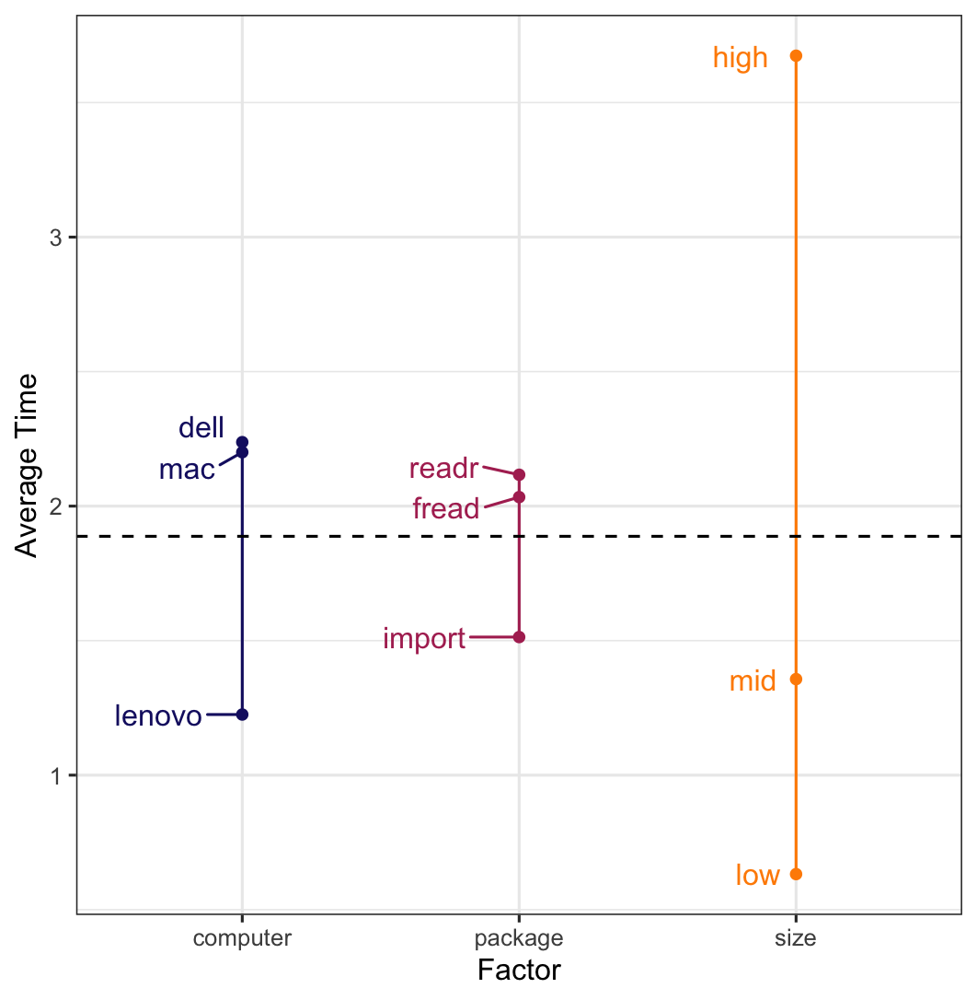

```{r setup, include=FALSE}
knitr::opts_chunk$set(echo = FALSE,
                      warning = FALSE,
                      message = FALSE,
                      comment = "")
```

```{r}
library(tidyverse)
theme_set(theme_bw())
library(patchwork)
library(broom)
library(car)
library(rcompanion)
```

```{r}
res <- bind_rows(read_csv("res_quang.csv"),
                 read_csv("res_rob.csv"),
                 read_csv("res_lance.csv")) %>% 
  mutate(computer = str_replace(computer, "lance", "dell"),
         computer = str_replace(computer, "rob", "lenovo"),
         computer = str_replace(computer, "quang", "mac"),
         
         across(where(is_character), factor))
```

#   Outline

*   Background

*   Experiment

*   ANOVA

*   Additional Analysis

*   Discussion

#   Background

*   Statisticians struggle with reading in large dataset [@gregcsv]

*   `read.csv`, part of `base` `R` [@baser], is old and slow.

*   There are better and more efficient data I/O algorithms in `R` [@efficient]

    *   `rio::import()` [@rio]
    
    *   `readr::read_csv()` [@readr] - part of `tidyverse` [@tidyverse]
    
    *   `data.table::fread()` [@datatable]
    
#   Experiment

*   $3^3$ factorial design [@montgomery]

    *   File size: low (~0.5GB), medium (~1.2GB), high (~2GB)
    
    *   Computer: Lenovo, Dell, MacBook
    
    *   Function: `rio::import()`, `readr::read_csv()`, `data.table::fread()`

*   Model: insert formula

*   $n = 20$ replicates

*   How were the data generated?

#   Data Understanding

<!-- 
use interaction plots to understand the behavior of one variable depends on the value of another variable. 
-->

*   Interaction plots

```{r}
p1 <- res %>% 
  group_by(size, package) %>% 
  summarize(avg_time = mean(time)) %>% 
  ungroup() %>% 
  ggplot(aes(size, avg_time)) +
  geom_line(size = 1, aes(group = package, color = package)) +
  geom_point(size = 2.5, aes(color = package), shape = 15) +
  theme(legend.position = "bottom")

p2 <- res %>% 
  group_by(size, computer) %>% 
  summarize(avg_time = mean(time)) %>% 
  ungroup() %>% 
  ggplot(aes(size, avg_time)) +
  geom_line(size = 1, aes(group = computer, color = computer)) +
  geom_point(size = 2.5, aes(color = computer), shape = 15) +
  theme(legend.position = "bottom")

p3 <- res %>% 
  group_by(package, computer) %>% 
  summarize(avg_time = mean(time)) %>% 
  ungroup() %>% 
  ggplot(aes(package, avg_time)) +
  geom_line(size = 1, aes(group = computer, color = computer)) +
  geom_point(size = 2.5, aes(color = computer), shape = 15) +
  theme(legend.position = "bottom")
```

```{r, fig.width=10, fig.height=3.5}
p1 + p2 + p3
```

#   ANOVA

*   All model terms are significant...

```{r}
mod <- lm(time ~ computer * size * package, data = res)
df <- mod %>% 
  anova() %>% 
  tidy() %>% 
  mutate(across(where(is.numeric), ~ round(.x, 4)))

names(df) <- c("Term", "df", "SS", "MS", "F", "p-value")

df
```

\vspace{-4mm}

*   However ...

#   ANOVA

*   There are issues with both **normality** and **homoscedasticity**

```{r}
pqq <- tibble(resid = resid(mod)) %>% 
  ggplot(aes(sample = resid)) +
  stat_qq() + 
  stat_qq_line(linetype = "dashed")

prvf <- tibble(resid = resid(mod),
             fitted = fitted(mod)) %>% 
  ggplot(aes(fitted, resid)) +
  geom_point() +
  geom_hline(yintercept = 0, linetype = "dashed")
```

```{r, fig.width=6, fig.height=3}
pqq + prvf
```

\vspace{-4mm}

*   Confirmed by Shapiro-Wilk and Levene tests (both with $p$-value $\approx 0$)

#   ANOVA

*   Transforming the data (log, Box-Cox) did not fix issues with model assumptions

*   This leads us to consider a nonparametric approach, 
    
    *   No distribution assumption about the data

    *   Permutation test for a three way factorial designs
 
    *   `asbio::perm.fact.test()` [@asbio]    

#   ANOVA

*   A permutation test gives significant results

```{r}
perm.fact.test <- function(Y,
                           X1,
                           X2,
                           X3 = NA,
                           perm = 100,
                           method = "a") {
  if (all(is.na(X3))) {
    init.model <- anova(lm(Y ~ X1 * X2))
  }
  if (all(!is.na(X3))) {
    init.model <- anova(lm(Y ~ X1 * X2 * X3))
  }
  
  r <- length((init.model)$"F value") - 1
  F.init <- init.model$"F value"[1:r]
  MS <- init.model$"Mean Sq"
  
  # (a)
  if (method == "a") {
    F.perm <- matrix(nrow = r, ncol = perm)
    if (all(is.na(X3))) {
      for (i in 1:perm) {
        Y.new <- sample(Y, replace = FALSE)
        F.perm[, i] <- anova(lm(Y.new ~ X1 * X2))$"F value"[1:r]
      }
    }
    
    if (all(!is.na(X3))) {
      for (i in 1:perm) {
        Y.new <- sample(Y, replace = FALSE)
        F.perm[, i] <- anova(lm(Y.new ~ X1 * X2 * X3))$"F value"[1:r]
      }
    }
  }
  
  
  # (b)
  if (method == "b") {
    MS.perm <- matrix(nrow = r + 1, ncol = perm)
    if (all(is.na(X3))) {
      for (i in 1:perm) {
        Y.new <- sample(Y, replace = FALSE)
        MS.perm[, i] <- anova(lm(Y.new ~ X1 * X2))$"Mean Sq"
      }
    }
    
    if (all(!is.na(X3))) {
      for (i in 1:perm) {
        Y.new <- sample(Y, replace = FALSE)
        MS.perm[, i] <- anova(lm(Y.new ~ X1 * X2 * X3))$"Mean Sq"
      }
    }
    
    F.perm <- matrix(nrow = r, ncol = perm)
    for (i in 1:perm) {
      F.perm[, i] <- MS.perm[, i][1:r] / MS.perm[, i][r + 1]
    }
  }
  
  p1 <- matrix(nrow = r, ncol = perm)
  for (i in 1:r) {
    p1[i, ] <- F.perm[i, ] >= F.init[i]
  }
  
  p2 <- apply(p1, 1, function(x) {
    length(x[x == TRUE])
  })
  
  p.val <- (p2 + 1) / perm
  p.val <- ifelse(p.val > 1, 1, p.val)
  
  if (all(is.na(X3))) {
    Table <-
      data.frame(
        Initial.F = init.model$"F value",
        Df = init.model$"Df",
        row.names = c("X1", "X2", "X1:X2", "Residual"),
        pval = c(p.val, NA)
      )
  }
  if (all(!is.na(X3))) {
    Table <-
      tibble(
        Term = c(
          "X1",
          "X2",
          "X3",
          "X1:X2",
          "X1:X3",
          "X2:X3",
          "X1:X2:X3",
          "Residual"
        ),
        InitialF = init.model$"F value",
        DF = init.model$"Df",
        pval = c(p.val, NA)
      )
  }
  res <- list()
  res$Table <- Table
  res
}

set.seed(69)
perm <- perm.fact.test(Y = res$time,
                       X1 = res$size,
                       X2 = res$computer,
                       X3 = res$package,
                       perm = 9999)

d <- perm$Table %>% 
  mutate(Term = str_replace(Term, "X1", "size"),
         Term = str_replace(Term, "X2", "computer"),
         Term = str_replace(Term, "X3", "package"),
         across(where(is.numeric), ~ round(.x, 4)))

names(d) <- c("Term", "Initial F", "df", "p-value")

d
```

#   ANOVA

*   Post-hoc analysis: pairwise permutation tests

*   Use False Discovery Rate [@fdr] as $p$-value adjustment method

*   Which pairs differ in mean reading time?

    *   Speed: all pairs
    
    *   Computer: Lenovo-Dell, Lenovo-Mac
    
    *   Package/Function: `data.table::fread()` - `rio::import()`, `rio::import()` - `readr::read_csv()`
    
#   ANOVA

*   Univariate effects plot of the factors

\vspace{-1mm}

\begin{center}

```{r, out.width = "60%"}

```

\end{center}

#   Additional Analysis

*   Investigate reading method (package/function) for MacBook only

```{r, fig.height=2.9, fig.width=4, fig.align='center'}
res %>% 
  group_by(package, computer) %>% 
  summarize(avg_time = mean(time)) %>% 
  ungroup() %>% 
  ggplot(aes(package, avg_time)) +
  geom_line(size = 0.5, aes(group = computer, color = computer)) +
  geom_point(size = 1.5, aes(color = computer), shape = 15) +
  theme(axis.title = element_text(size = 9),
        legend.text = element_text(size = 8),
        axis.text = element_text(size = 8),
        legend.title = element_text(size = 9))
```

#   Additional Analysis

*   A simulation study

*   Simulate more data, in addition to the existing 3 data files

*   Consider 10 file sizes (in GB)

    *   ${\textbf{0.49}, \textbf{1.22}, 1.51, 1.73, \textbf{1.96}, 2.16, 2.36, 2.61, 2.94, 3.32}$
    
*   Use MacBook to read in each file using the 3 functions, and record the time elapsed

#   Additional Analysis

*   ANCOVA

    *   Response: time elapsed (in seconds)
    
    *   Treatment: function (3 levels)
    
    *   Covariate: file size (in GB)

```{r}
dat <- read_csv("add.csv") %>% 
  mutate(meth = factor(meth))
```

```{r}
anc <- aov(elapsed ~ meth + size, data = dat)
a <- anc %>% 
  car::Anova(type = "III") %>% 
  tidy() %>% 
  mutate(across(where(is.numeric), ~ round(.x, 4)))

names(a) <- c("Term", "SS", "df", "F", "p-value")

a
```

#   Additional Analysis

*   Model assumptions are met.

```{r}
anc %>% 
  pluck("residuals") %>% 
  shapiro.test() %>% 
  tidy() %>% 
  mutate(across(where(is.numeric), ~ round(.x, 4)))

leveneTest(elapsed ~ meth, data = dat) %>% 
  tidy() %>%
  mutate(across(where(is.numeric), ~ round(.x, 4)),
         method = "Levene test")
```

#   Additional Analysis

*   Multiple comparisons - Tukey contrasts

```{r}
library(multcomp)
glht(anc, linfct = mcp(meth = "Tukey")) %>% 
  tidy() %>% 
  mutate(across(where(is.numeric), ~ round(.x, 4))) %>% 
  dplyr::select(-null.value, -term) %>% 
  rename(se = std.error,
         `adj p-value` = adj.p.value)
```

*   `readr` significantly differs from the other 2 methods when using Mac.

#   Cheers.

*   Acknowledgments

    *   Lance Davis
    
    *   Mike Perry
    
    *   Greg Matthews
    
*   Take advantage of more efficient algorithms!!!
    
*   Greg's YouTube video: [youtu.be/E5KJkooW4RY](https://youtu.be/E5KJkooW4RY)

*   GitHub: [github.com/qntkhvn/read_speed](https://github.com/qntkhvn/read_speed)

*   Question?  

# References {.allowframebreaks}